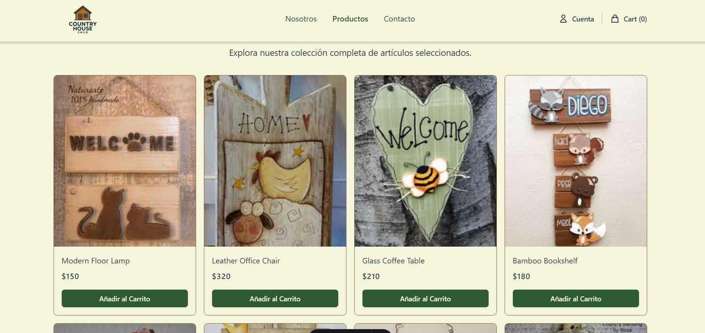

# Country House Chile - E-commerce Store



## Project Description

Country House Chile is a modern and responsive e-commerce platform designed to offer an intuitive and pleasant shopping experience. This project simulates a complete online store, allowing users to explore products, manage a shopping cart, and perform authentication and checkout processes. The application is built with a focus on performance, scalability, and an attractive user interface.

## Key Features

*   **Product Catalog:** Browsing and detailed viewing of products.
*   **Shopping Cart:** Functionality to add, update, and remove products from the cart.
*   **User Authentication:** User registration, login, and profile management.
*   **Checkout Process:** Simulation of a secure purchasing flow.
*   **Responsive Design:** Adaptability to different screen sizes (mobile, tablet, desktop).
*   **Fluid Animations:** Enhanced user experience with transitions and visual effects.

## Technology Stack

Country House Chile is built using the following key technologies:

*   **Astro:** A modern web framework for building fast, content-focused websites, with an islands architecture for optimal performance.
*   **Tailwind CSS:** A utility-first CSS framework that allows for rapid custom design building without leaving your HTML.
*   **Supabase:** An open-source alternative to Firebase, providing a PostgreSQL database, authentication, instant APIs, and file storage.
*   **TypeScript:** A typed superset of JavaScript that improves code quality and developer productivity.
*   **GSAP (GreenSock Animation Platform):** A powerful JavaScript library for creating high-performance animations.
*   **Lenis:** A lightweight library for smooth and customizable scrolling.

## Folder Structure

The project organization follows a logical structure to facilitate development and maintenance:

```
.
├── public/                 # Static assets (images, videos, etc.)
│   └── countryhousechile.png
├── src/                    # Application source code
│   ├── components/         # Reusable Astro components
│   ├── layouts/            # Layout templates for pages
│   ├── lib/                # Utility functions (Supabase, cart, animations)
│   ├── middleware/         # Middleware logic for Astro
│   ├── pages/              # Application pages (routes)
│   │   ├── api/            # API endpoints (authentication)
│   │   └── products/       # Product detail pages
│   └── styles/             # Global and Tailwind CSS styles
├── astro.config.mjs        # Astro configuration
├── tailwind.config.mjs     # Tailwind CSS configuration
├── tsconfig.json           # TypeScript configuration
├── package.json            # Project dependencies and scripts
└── README.md               # This file
```

## Author

**JavGarin**

## License

This project is licensed under the MIT License. See the `LICENSE` file for more details.
